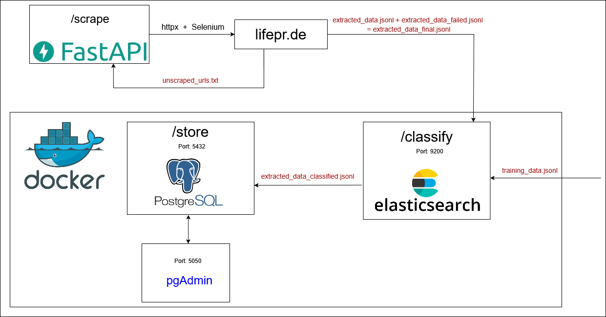
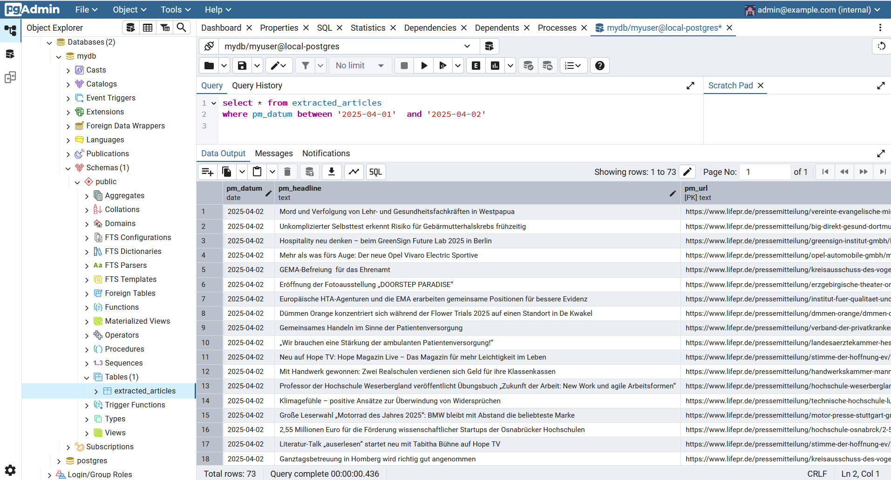

# Übersicht

Dieses Projekt dient dazu, aktiver Pressemitteilungen der letzten 6 Monate von der Plattform lifepr.de automatisiert zu extrahieren. Sowohl Unternehmensdaten als auch Kontaktdaten werden  extrahiert. Anschließend wird jede Pressemitteilung mithilfe Branchenklassifizierung in eine passende Kategorie zugeordnet. Abschließend werden die Daten in einer PostgreSQL-Datenbank gespeichert.



Das Projekt besteht aus mehreren Python-Skripten, die jeweils einen bestimmten Aufgabenbereich erfüllt:

### 1. main.py

Enthält den haupt Flow (die FastAPI-Endpunkte). Hier werden:
- Scraping-Funktion (`/scrape`) gestartet. Die Ergebnisse werden in `extracted_data.jsonl` und nach möglichen wieder Versuchen in `extracted_data_final.jsonl` gespeichert.
- Klassifizierung (`/classify`) ausgeführt. Erzeugt aus `training_data.jsonl` einen Elasticsearch-Index, berechnet Branchen und schreibt das Resultat in `extracted_data_classified.jsonl`.
- und schließlich die Daten in PostgreSQL gespeichert (`/store`). Liest `extracted_data_classified.jsonl` ein und führt die Daten in die Tabelle `extracted_articles` ein.

### 2. scraper_functions.py

Hier befinden sich die Methoden zum Webscraping. Das umfasst:
- Laden von Pressemitteilungen-URLs,
- Auslesen von Unternehmendaten und Kontaktdaten pro Pressemitteilung,
- Speichern der Ergebnisse in JSONL-Dateien.

### 3. elastic_search.py

Dieses Modul lädt ein trainiertes Sprachmodell und nutzt Elasticsearch, um mithilfe vordefinierter Trainingsdaten eine Zuordnung zur passenden Branche zu treffen.

### 4. docker-compose.yml

Das Docker-Setup mit Containern für PostgreSQL, Elasticsearch und pgAdmin.


# Ablauf des Projekts

### 1. Scraping

1.	HTTPX und BeautifulSoup werden verwendet, um die Übersichtsseiten von lifepr.de zuzugreifen und Links zu Pressemitteilungen zu sammeln.
2.	In diesem Prozess wurde FastAPI verwendet. Dadurch wurde Scraping etwa dreimal schneller.
3.	Für jede Pressemitteilung wird die eigine seite aufgerufen und analysiert.
4.	Es werden Veröffentlichungsdatum, Headline, URL, Firmendaten , Ansprechpartner-Daten, Artikeltext, Kategorien und Schlüsselwörter erfasst.
5.	Um nicht zu schnell Anfragen an lifepr.de zu stellen, enthalten die Funktionen künstliche Pausen und rotierende User-Agents.
6.	Um E-Mail-Adressen korrekt auszulesen, kommt zusätzlich Selenium zum Einsatz. Damit können eventuell versteckte oder dynamisch geladene E-Mail-Felder sichtbar gemacht werden. Weil die E-Mail-Adresse von Ansprechpartners ausgeblendet ist, handelt es sich um die in HTML angegebenen E-Mails, abgesehen von der Firmen-E-Mail-Adresse.
7.	Die gesammelten Daten werden in JSONL-Dateien (`extracted_data.jsonl`) gespeichert. Mögliche Fehlschläge beim Scraping (z. B. wenn Seiten nicht geladen werden konnten) werden in einer Datei `unscraped_urls.txt` gelistet und anschließend nochmal versucht.
8.	Die Daten werden zuletzt zu einer finalen Datei `extracted_data_final.jsonl` zusammengeführt.


### 2. Branchenklassifizierung mit Elasticsearch 

###### 1. Trainingsdaten vorbereiten

Für die Klassifizierung braucht man zuerst Trainingsdaten (`training_data.jsonl`). Man kann die Datei über `training_data.ipynb` generieren. Diese Datei enthält Texte, Schlagwörter, Kategorien und die dazugehörige Branche. Insgesamt sind 110 Artikeln in `training_data.jsonl` 11 Branche zugeordnet: 
"Bildung & Wissenschaft", "Politik & Gesellschaft", "Kultur & Tourismus & Urlaub", "Technik & Elektronik", "Sport & Freizeit & Unterhaltung",   "Finanzen & Versicherung", "Energie & Umwelt", "Gesundheit & Medizin", "Essen & Trinken", "Immobilien & Bauen", "Verkehr & Logistik".


##### 2. Trainingsphase (train_and_index_training_data)

-	Es wird ein neuer Elasticsearch-Index erstellt (`training_data_index`). Dieser enthält ein Feld für Vektoren, das später für die Hybridsuche genutzt wird.
-	Jeder Eintrag aus den Trainingsdaten wird:
    -	bereinigt (z. B. Kleinschreibung, Sonderzeichen entfernen),
    -	in einen Vektor mit 512 Zahlen umgewandelt (mit dem Multilingual Universal Sentence Encoder),
    -	und in Elasticsearch gespeichert.

##### 3. Klassifikation der Pressemitteilungen (classify_extracted_data)

-	Die Pressemitteilungen aus der Datei `extracted_data_final.jsonl` werden zuerst nach Unternehmen gruppiert. Dabei werden alle Texte, Schlagwörter und Kategorien pro Unternehmen zusammengefügt.
-	Für jeden dieser Einträge wird:
    -	der Text bereinigt,
    -	ein Vektor berechnet,
    -	und mit den Vektoren aus den Trainingsdaten verglichen (mittels Cosine-Similarity).
-	Zusätzlich wird die Hybridsuche in Elasticsearch durch Keyword-Boosting unterstützt. Das bedeutet, dass Schlagwörter und Kategorien stärker gewichtet werden können. Parameter können mithilfe `classify_and_return` angepasst werden.

##### 4. Ergebnis

-	Die Branche mit der höchsten Punktzahl wird als beste Übereinstimmung ausgewählt.
-	Diese Branche wird auf alle Unternehmen übertragen.
-	Die Ausgabe ist die Datei `extracted_data_classified.jsonl`, in der alle Artikel nun ein zusätzliches Feld `Branche` enthalten.


### 3. Speicherung in PostgreSQL

1.	Mit Endpunkt `/store` werden schließlich die klassifizierten Daten aus `extracted_data_classified.jsonl` eingelesen.
2.	Es wird sichergestellt, dass in PostgreSQL eine Tabelle namens `extracted_articles` existiert. Wenn das nicht der Fall ist, wird sie automatisch erstellt.
3.	Jede Zeile von JSONL-Datei wird iteriert und in die Tabelle eingefügt.
- Bereits vorhandene Datensätze (gleiche `PM_URL` als Primärschlüssel) werden ignoriert.
4.	Abschließend erhält man eine Datenbank mit allen gescrapten und klassifizierten Pressemitteilungen.




# Installation & Ausführung

Voraussetzungen:
-	Python 3.10.11
-	Requirements.txt (virtual environment)
-	Docker & Docker Compose (PostgreSQL, Elasticsearch und pgAdmin)
-	Chrome / Chromium + ChromeDriver (für Selenium)

# Schritte

1. Virtual environment erstellen:

```bash
python -m venv venv
source venv/bin/activate   
```

2. Abhängigkeiten installieren:

```bash
pip install -r requirements.txt
```

3. Docker-Container erstellen und starten:

```bash
docker-compose up –build
docker-compose up -d
```

4. Dadurch werden gestartet:
-	PostgreSQL (Port 5432)
-	Elasticsearch (Port 9200)
-	pgAdmin (Port 5050)

5. FastAPI-Anwendung lokal starten:

```bash
uvicorn main:app –reload
```

http://localhost:8000/scrape
http://localhost:8000/classify
http://localhost:8000/store


# Verbesserungen

Die folgenden Verbesserungen können eine präzisere Zuordnung von Branchen ermöglichen:

– Fine-tuning kann erfolgen, um Parameter für eine höhere Genauigkeit zu ermitteln. Dazu können vorbereitete Testdaten mit Unternehmen und genauen Branchen verwendet werden. Dieser Prozess ist zeitaufwändig und erfordert jedoch leistungsstarke Computer.
– Trainingsdaten können erweitert und diversifiziert werden, um die Zuordnungsgenauigkeit zu erhöhen.


